# Stitch Space: a fibre art portfolio social site

This repository contains the front-end code for the Stitch Space website. The back-end API repository can be found [here](https://github.com/EvitaKnits/stitch-space-API). The front end is built using Vite, React, React-Bootstrap, JavaScript, and JSX, and is hosted on Heroku.

This README focuses on the front-end components and functionality within this repository. It also includes general information on the project, such as competitor analysis, development management using GitHub Projects, and the Agile methodology employed throughout the development process. For information regarding the back-end API, please refer to the README in the back-end repository.

To visit the deployed Stitch Space site [click here](https://stitch-space-f65c363b25bd.herokuapp.com/)

## Table of Contents

1. [Purpose](#1-purpose)
2. [Features](#2-features)
3. [Requirement Gathering and Planning](#3-requirement-gathering-and-planning)
    - [Brief Competitor Analysis and Target Demographic](#brief-competitor-analysis-and-target-demographic)
    - [Epics and User Stories](#epics-and-user-stories)
    - [User Journeys](#user-journeys)
    - [User Permissions](#user-permissions)
    - [API Integration](#api-integration)
    - [Data Validation](#data-validation)
    - [Error Messaging](#error-messaging)
4. [User Interface Design](#4-user-interface-design)
    - [Wireframes](#wireframes)
    - [Colour Scheme](#colour-scheme)
    - [Icons](#icons)
5. [Testing](#5-testing)
    - [Continuous Testing](#continuous-testing)
    - [Automated Testing](#automated-testing)
    - [Manual Testing](#manual-testing)
    - [Browser Compatibility and Screen Size Responsiveness](#browser-compatibility-and-screen-size-responsiveness)
    - [Code Validation](#code-validation)
    - [Accessibility](#accessibility)
6. [Bugs](#6-bugs)
7. [Set Up and Deployment](#7-set-up-and-deployment)
    - [React with Vite Set Up](#react-with-vite-set-up)
    - [Deployment](#deployment)
8. [Agile Methodology](#8-agile-methodology)
    - [Sprint One](#sprint-one-0909-to-1509)
    - [Sprint Two](#sprint-two-1609-to-2209)
    - [Sprint Three](#sprint-three-2309-to-2909)
9. [Future Development](#9-future-development)
10. [Credits](#10-credits)

## 1. Purpose

The goal of this site is to create a dedicated space for fibre artists to showcase their portfolios, allowing their work to be viewed, appreciated, and socially engaged with by fellow fibre artists.

## 2. Features

### Existing Features

-   **Navigation Bar**: at the top of each page, the navigation bar provides all links required to access every part of the site. It is fully responsive and changes its contents depending on whether the user is signed in or not.

**Signed Out**


**Signed In**


-   **Home Page**: this page greets the user with a brief overview of what Stitch Space is about, provides an easy way to sign up and shows a small section of featured artists to give a preview of the art to prospective users.

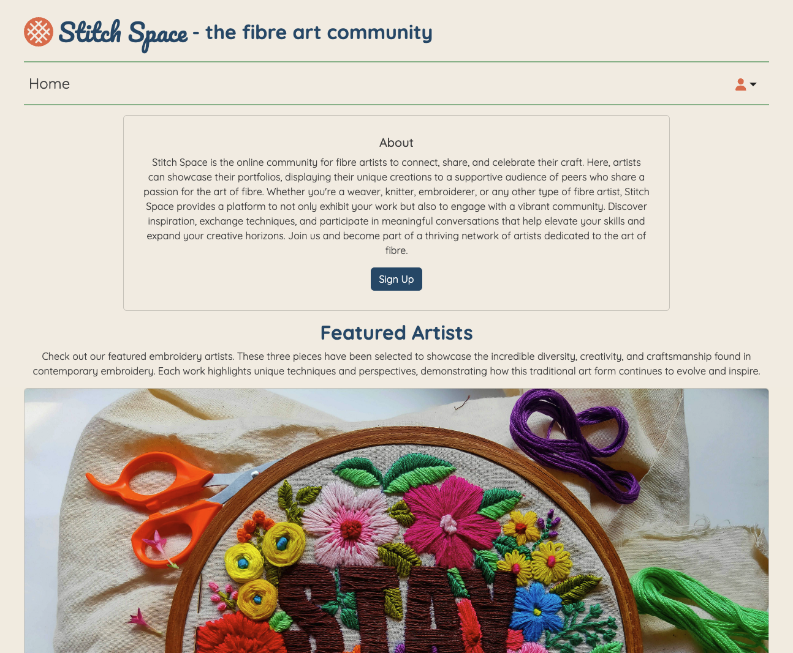

-   **Registration Page**: this is a simple and uncluttered page with a short form to fill in, in order to become a Stitch Space member.

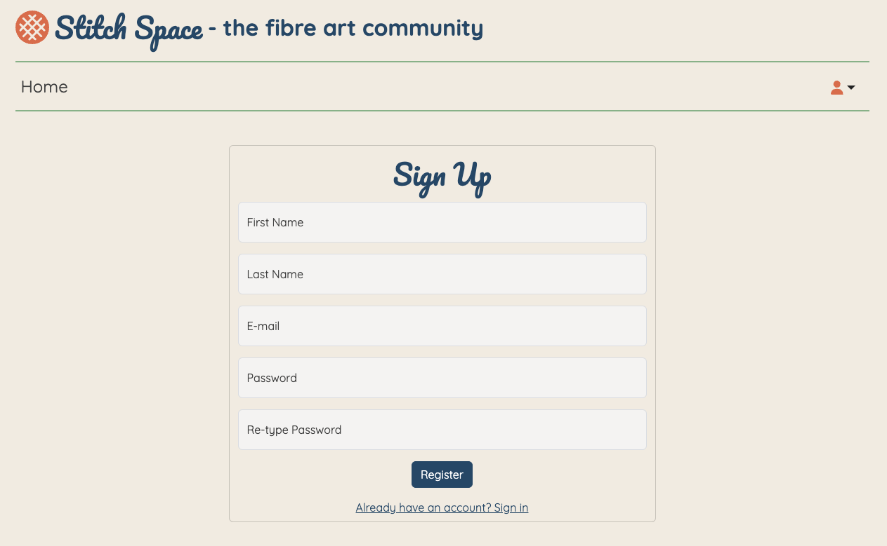

-   **Feed Page**: this page shows the artwork of all the people you follow, in one convenient place.


-   **Explore Page**: this page allows you to explore all artwork on the site and find new artists to follow. There are different filtering options to allow you to easily locate the type of work you are interested in.


-   **Notifications Dropdown**: this dropdown is available in the navigation bar and is therefore found on every page across the site. It provides you with a quick view into the interactions relevant to you. If another user follows you, rates your piece or comments on your piece, it will be displayed here for you to view. Rows show in bold if they've not been seen previously and are more greyed out if they have already been viewed.


-   **My Stitch Space Page**: this serves as your personal artist portfolio. The side bar gives an overview of you and the main part of the page is dedicated to displaying your artworks. There is a mini-navigation bar at the top to allow users to view all your pieces or just the pieces of each craft at a time.


-   **Followers/Following Sections**: the buttons in the profile side bar allow you to view the users following this artist, or the users this artist is following.


-   **Profile Editing Section**: it is possible to quickly and easily edit your profile details without leaving your 'My Stitch Space' page.


## 3. Requirement Gathering and Planning

### Brief Competitor Analysis and Target Demographic

When analyzing competitors in the realm of online portfolio platforms for artists, several notable options come to mind:

-   Instagram is a popular choice for artists looking to showcase their work due to its large user base and visual-centric approach. However, its broad focus across many content types means it lacks specific features tailored to fibre artists and their unique needs.
-   Etsy provides a platform for selling handmade goods, including fibre arts, but it primarily focuses on e-commerce rather than creating a dedicated portfolio space where artists can purely showcase and engage with their work.
-   Behance and DeviantArt are also widely recognized in the art community for portfolio presentation, but their generalist approach encompasses all art forms, which can make it harder for fibre artists to find a targeted audience and community.

In this landscape, Stitch Space aims to carve out a unique niche by offering a dedicated platform specifically for fibre artists. It focuses on providing a community-driven environment where artists can not only showcase their portfolios but also interact with peers, gain inspiration, and receive feedback. The goal is to foster a specialized community that supports and celebrates the work of fibre artists, making Stitch Space an ideal platform for those looking to share their craft in a more targeted and supportive setting.

### User Journeys

These are the core user journeys, it is not an exhaustive list of all possible user journeys, just the most important ones:

1. Sign Up and Edit User Details

```mermaid
flowchart LR
    A[Navigate to \n Stitch Space] --> B[Enter details on \nRegistration form]
    B --> C[Click Register \n button]
    C --> D[Log in with email \n and password]
    D --> E[Navigate to \n My Stitch Space page]
    E --> F[Click the Edit\n Profile button ]
    F --> G[Edit details or \n add picture or bio]
    G --> H[Save Changes]
```

2. Create a Piece

```mermaid
flowchart LR
    A[Log In] --> B[Navigate to personal \n Stitch Space page]
    B --> C[Click 'Add a \nNew Piece' button]
    C --> D[Fill in New\n Piece form]
    D --> E[Click 'Create \n Piece' button]
```

3. Browse and Interact with Pieces

```mermaid
flowchart TD
    A[Log In] --> B[Click 'Feed' in\n the navigation bar]
    A --> C[Click 'Explore' in \n the navigation bar]
    A --> D[Click 'My Stitch Space' in the \n dropdown from the user \n icon in the navigation bar]
    B --> E[Click on any piece]
    C --> F[Carry out a search, optionally\n adding any filters]
    F --> E
    D --> G[Click on 'Following' or 'Followers' \n and click on a specific user]
    G --> E
    E --> H[Comment on the piece or rate it, if not your own]
```

4. Edit or Delete a Piece

```mermaid
flowchart LR
    A[Log In] --> B[Navigate to personal \n Stitch Space page \n via the profile picture in \n the navigation bar]
    B --> C[Click on a piece \nthen the 'Edit Piece' button]
    C --> D[Change details \n in Piece form]
    D --> E[Click 'Save \n Changes' button]
    C --> F[Click on 'Delete \n Piece' button]
    F --> G[Confirm deletion \n on modal]
```

5. View Followers or Following

```mermaid
flowchart TD
    A[Log In] --> B[Navigate to personal \n Stitch Space page \n via the profile picture in \n the navigation bar]
    A --> C[Click 'Feed' in \n the navigation bar]
    A --> D[Click 'Explore' in the navigation bar]
    B --> E[Click on 'Followers' or 'Following' in the side bar]
    C --> F[Click on any piece then the artist's name]
    D --> G[Carry out a search search, optionally\n adding any filters]
    G --> F
    F --> E
```

6. View Notifications

```mermaid
flowchart LR
    A[Log In] --> B[Click on the Bell icon in the navigation bar]
```

### User Permissions

Before signing up, users can explore the home page to learn more about Stitch Space and view a sample of featured artists. They can also access the sign-up and login pages without needing an account.

Once signed in, users can access the full site, with restrictions ensuring they can only add, edit, or view their own personal details and artwork.

The table below provides a detailed overview of page access based on authentication and authorization:

Authentication: Requires the user to be logged in.
Authorization: Limits access to a user's own content.
Neither: Accessible without being logged in.

| Page                                 | Access Logged Out? | Access Logged In? | Access Only Own? |
| ------------------------------------ | ------------------ | ----------------- | ---------------- |
| Home                                 | Yes                | Yes               | N/A              |
| Sign Up                              | Yes                | No                | N/A              |
| Login                                | Yes                | No                | N/A              |
| Feed                                 | No                 | Yes               | Yes              |
| Explore                              | No                 | Yes               | N/A              |
| Personal Stitch Space: default       | No                 | Yes               | No               |
| Personal Stitch Space: add new piece | No                 | Yes               | Yes              |
| Personal Stitch Space: piece detail  | No                 | Yes               | No               |
| Personal Stitch Space: piece edit    | No                 | Yes               | Yes              |
| Personal Stitch Space: followers     | No                 | Yes               | No               |
| Notifications                        | No                 | Yes               | Yes              |

Admins can access the Django admin panel.

### API Integration

The HTTP requests specifications have been defined in detail, in the back-end API README, [here](https://github.com/EvitaKnits/stitch-space-API). These formats will be used.

**Authentication Mechanism**
JSON Web Tokens (JWTs) will be used for token-based authentication.

**Cross-Origin Resourcer Sharing (CORS)**
CORS will be configured on the Django back-end to allow requests from this React front-end. This will be done using the `django-cors-headers` package which will handle those settings.

**Data Fetching and State Management**
Axios will be used for making HTTP requests to the DJango REST API back-end.

React Context will be used for simple state management.

### Data Validation

Comprehensive data format specifications are available in the API repository's readme. This front-end ensures that only valid data is sent to the back end by performing field-level validation before submitting any requests.

### Error Messaging

The Django REST API back end will return meaningful HTTP status codes, enabling this React front end to display clear error messages to users, helping them identify and resolve issues. However, because the front end is defensively programmed to prevent scenarios that trigger 400, 404, or most other errors, only a few error messages will be necessary. The API-side error codes are documented to support potential direct API access or usage by different front ends. From this front end, only the following error messages are required:

| Scenario                                    | HTTP Status Code                                      | Error Message                                                                                                                                         |
| ------------------------------------------- | ----------------------------------------------------- | ----------------------------------------------------------------------------------------------------------------------------------------------------- |
| Add a new user                              | 409 Conflict                                          | A user with this email address already exists. Please log in if you already have an account, or enter a different email address to create a new user. |
| Edit user details                           | 409 Conflict                                          | It is not possible to change your email address to this value, as this email address is already taken. Please enter a different email address         |
| All scenarios where there is a server error | 500 Internal Server Error and 503 Service Unavailable | A technical issue occurred, please try again later.                                                                                                   |

## 4. User Interface Design

### Wireframes

The wireframes were created using Balsamiq and they illustrate the core user interface and functionality of Stitch Space from a monitor and mobile device perspective. These visual guides serves as the blueprint for the structure and design of the application, ensuring a cohesive and intuitive user experience.

#### Home Page

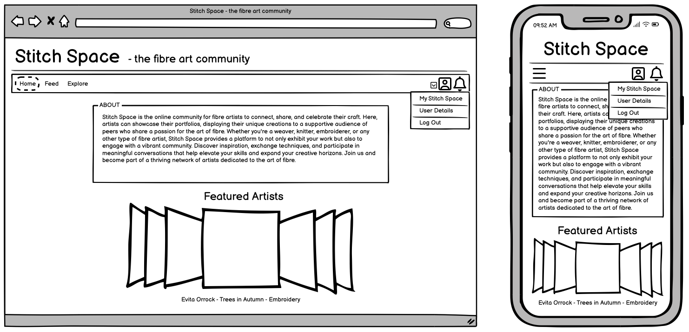

#### Feed

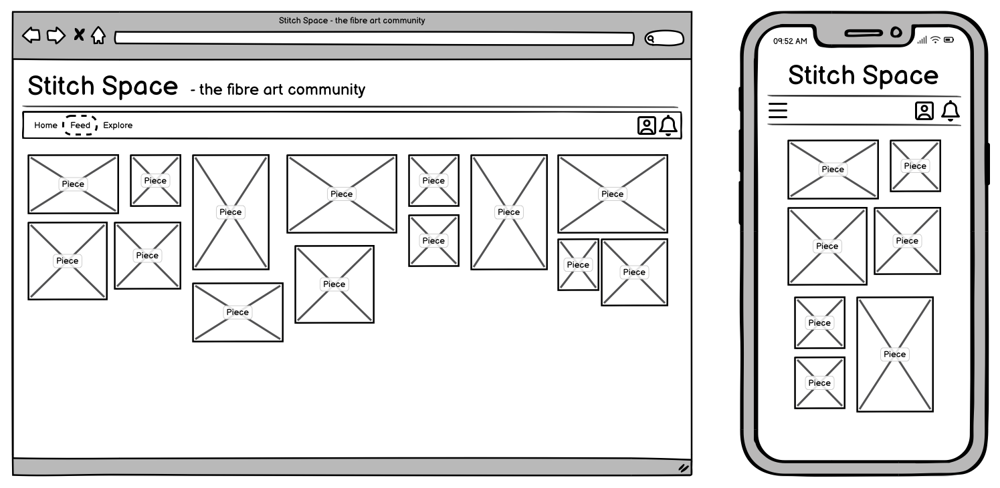

#### Explore

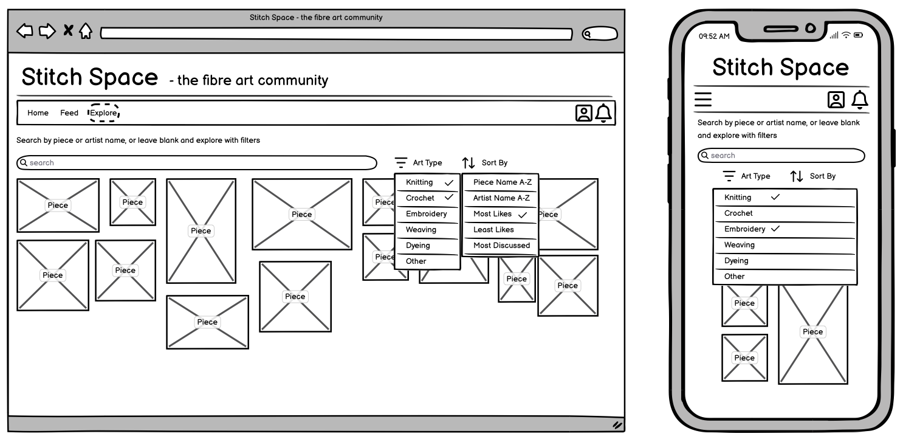

#### My Stitch Space

Default View:


Piece Detail View:
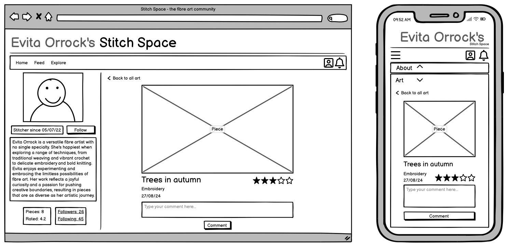

Piece Edit View:
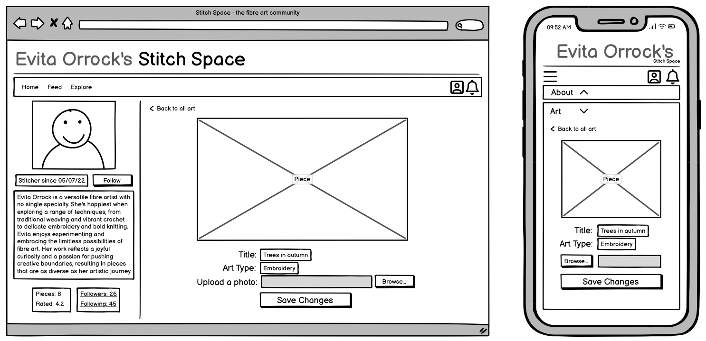

Followers/Following View:
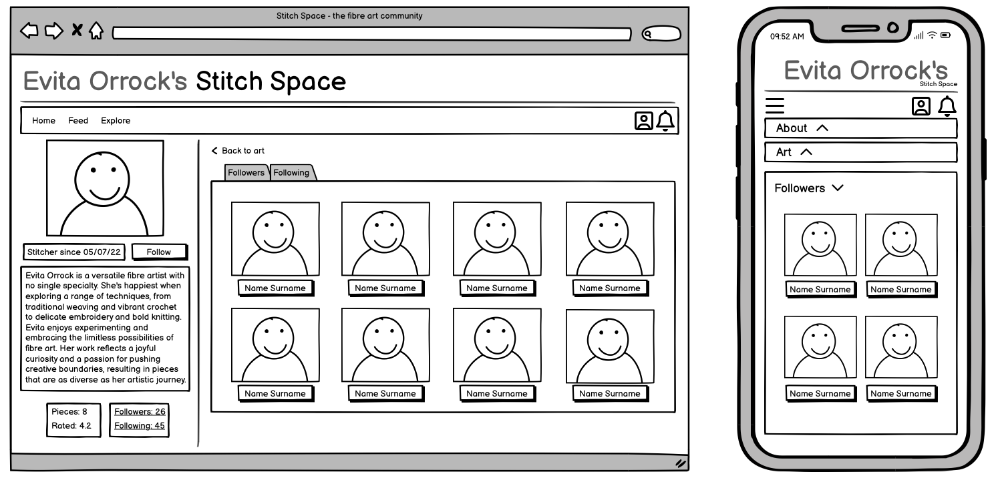

#### User Details


#### Notifications

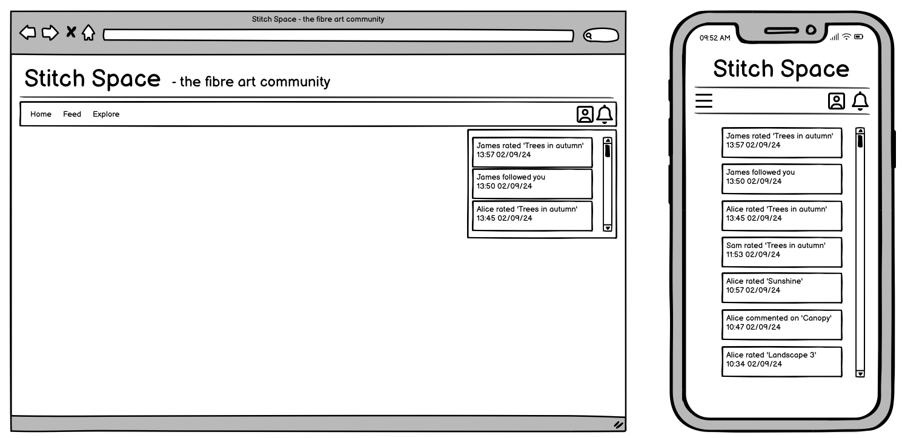

#### Sign Up

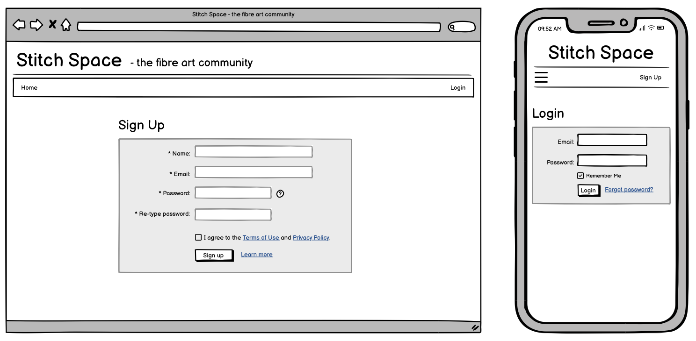

#### Development Notes

The wireframes were broadly stuck to during development, non-minor changes are listed below, with their reasoning:

-   Home Page:

    -   A sign up button was added to the 'About' section when the user was not logged in. This made it easier for new users to sign up right from the home page rather than having to navigate to the navigation bar.
    -   The 'User Details' item was removed from the user icon dropdown as this was not implemented as a separate page in the end (see why in the last part of this section below).

-   My Stitch Space:

    -   The user level rating in the Profile side bar of this page was not implemented and has now been added to the future development list. This was not a required piece of functionality for the MVP of this site.
    -   The mobile view was not implemented to have dropdown sections, as it was much cleaner to just stack the content and make it scrollable.
    -   There is no upload for photos - instead, URLs of photos hosted elsewhere are used for the MVP of this site. The ability to upload photos directly has been added to the future development list.

-   User Details:
    -   This page was removed completely, because all the edits to the user's information could easily and cleanly be done from the side bar itself, rather than having to navigate to a whole separate page
    -   Art Types' at the user level was also dropped as this was not required for any functionality after all.

### Colour Scheme

I wanted to pick a fun and energetic palette to reflect the creative nature of this application. My original choices looked great next to each other in theory but when I came to implementing them, they didn't quite work. So after some finessing, I ended up with the following colour scheme:

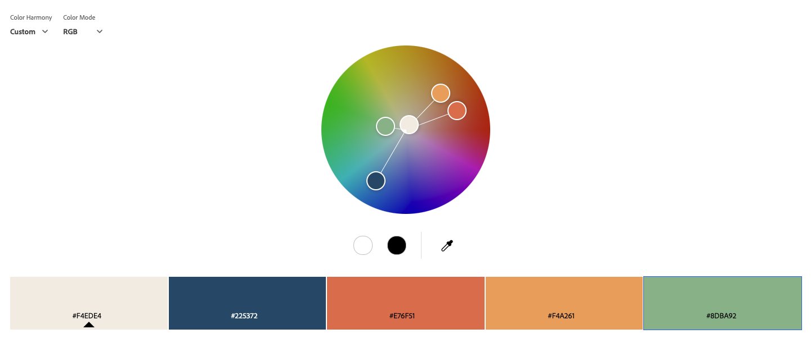

### Icon

I searched Font Awesome for an icon that could be used that aligns with the theme. I found this 'Stroopwafel' icon which, although represents a waffle, actually also looks like a snippet of cross stitch canvas, so I decided to use it.

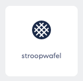

## 5. Testing

### Continuous Testing

Through a combination of automated testing written using Jest for JavaScript, and manual testing from the front-end, I achieved a good coverage of test cases. The code I wrote was also passed through validators/linters at the end to ensure adherence to coding standards and best practices, ultimately aiming for robust and maintainable code.

### Automated Testing

When I was sufficiently through my project to have a stable enough codebase, I added basic automated testing for the core functionality of the application, using React Testing Library.

### Manual Testing

This made up the bulk of the testing and was carried out continuously throughout the build, ensuring each change had the intended result.

My manual testing at the end covered:

-   Each user journey from end to end
-   The level of access when logged out
-   The level of access when logged in and whether the user could only access their own personal details and pieces of functionality intended only for them

### Browser Compatibility and Screen Size Responsiveness

I viewed the site on each of the three key screen sizes (mobile, tablet and computer), using devtools, on four of the most popular browsers. I also used the responsive setting to slide the width of the screen from narrow all the way through to wide to check the transition points.

Pixel references for each of the screen sizes:

| Screen             | Pixels |
| ------------------ | ------ |
| Mobile - iPhone SE | 375px  |
| Tablet - iPad Mini | 768px  |
| Computer           | 1366px |

| Browser | Screen Size       | Appearance | Responsiveness |
| ------- | ----------------- | ---------- | -------------- |
| Chrome  | Mobile            |            |                |
|         | Tablet            |            |                |
|         | Computer          |            |                |
|         | Transition Points |            |                |
| Firefox | Mobile            |            |                |
|         | Tablet            |            |                |
|         | Computer          |            |                |
|         | Transition Points |            |                |
| Safari  | Mobile            |            |                |
|         | Tablet            |            |                |
|         | Computer          |            |                |
|         | Transition Points |            |                |
| Edge    | Mobile            |            |                |
|         | Tablet            |            |                |
|         | Computer          |            |                |
|         | Transition Points |            |                |

### Code Validation

| Language   | Validation Method                                                             | Outcome |
| ---------- | ----------------------------------------------------------------------------- | ------- |
| HTML       | Via direct input on [W3C HTML Validator](https://validator.w3.org/)           |         |
| CSS        | Via direct input on [W3C CSS Validator](https://jigsaw.w3.org/css-validator/) |         |
| JavaScript | [JS Hint](https://jshint.com/)                                                |         |
| Python     | [CI Python Linter](https://pep8ci.herokuapp.com/)                             |         |

### Accessibility

**Lighthouse**

To ensure the front end of my program was accessible I used Lighthouse and recorded the final results for each page below:

| Page | Result |
| ---- | ------ |

**Colour Contrast**

## 6. Bugs

Here is a list showing a small selection of bugs found towards the end of development. This list is not exhaustive but is intended to give a sample of the types of things that were found and fixed. I don't believe I have left any unresolved bugs.

### Bug One

Issue: The background colour of the Notifications drop down button in the Navigation bar was the primary colour used for other buttons, but should match the beige background colour in this context, like the dropdown user button next to it.


Fix: I removed the separate NotificationsDropdown.module.css file and imported the file styling the user icon button (NavBar.module.css) so they would match, as they are both in the navigation bar. I moved the styling I wanted to keep for the notification items too.


### Bug Two

Issue: The 'Sign Up' button that had previously shown up in the 'About' section of the home page when the user viewing the page was not signed in, disappeared at some point during development.

Fix: I found that I was not handling the loading state properly in the context so the condition for the sign up button to appear was never met. I moved the setting of the loading state to a 'finally' clause at the end (see below), to ensure it would be set corectly and the button would appear in the right circumstances.

**Sign up button**
```
{!userContext.loading && !userContext.currentUser && (
    <div className="d-flex justify-content-center">
        <Button
            className={styles.SignUpButton}
            onClick={handleSignUpClick}
        >
            Sign Up
        </Button>
    </div>
)}
```

**Context**
```
const handleMount = async () => {
    try {
        const { data } = await axiosClient.get('dj-rest-auth/user/')
        setCurrentUser(data)

    } catch (err) {
        console.error(err)
    }
    finally {
        setLoading(false)
    }
}
```

This is the button showing up as intended post-fix:

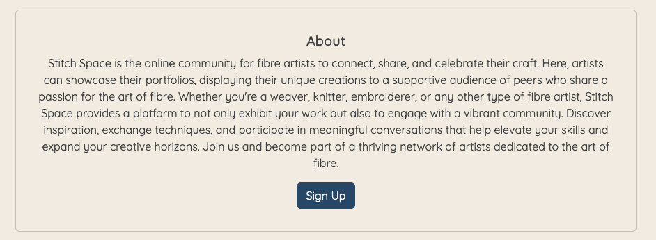

### Bug Three

Issue: Clicking on the 'Sign Up' link in the user dropdown found in the navigation bar, redirects to the 'Login' page.

Fix: I changed all the 'href' links in the NavBar.jsx file to use 'Link' from react-router-dom.

### Bug Four

Issue: Registering a new user, doesn't assign their first name and last name correctly to the database, thus their Stitch Space is wrong.

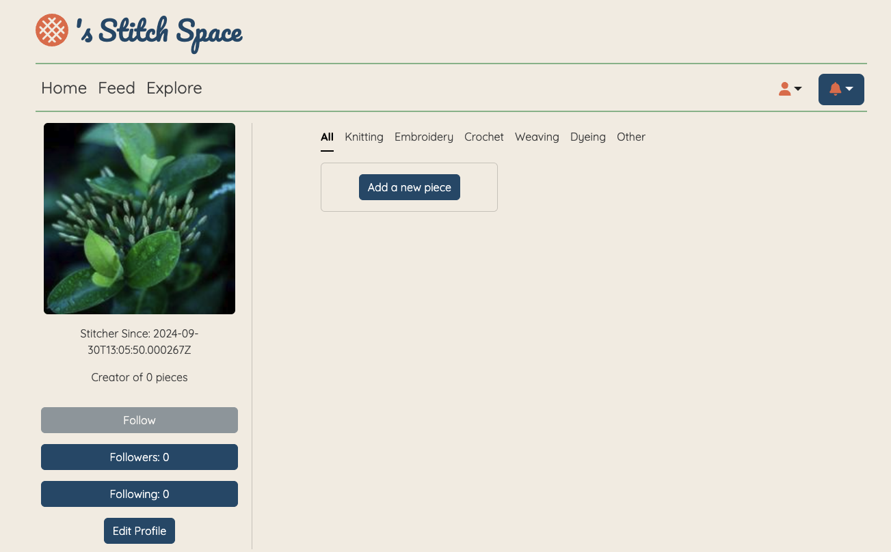

Fix:

### Bug Five

Issue: The 'Stitcher Since' timestamp was not showing a very user friendly date. (See image from bug four which also shows bug five's issue)

Fix:

### Bug Six

Issue: The Navigation Bar doesn't indicate which page you are currently on in any way. This needs changing to be less confusing.


Fix:

### Bug Seven

Issue: It is currently possible for a user to rate their own pieces

Fix:

### Bug Eight

Issue: The colour of the icons in the notification dropdown do not match the colour scheme and the rest of the icons on the site.

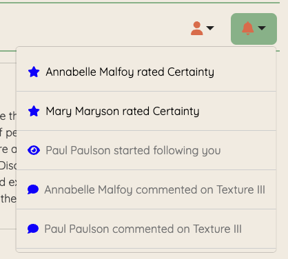

Fix: I found that I had accidentally left in some inline styling I added to these icons when I was first sketching out the notifications dropdown and wanted to make them more visible. I removed this and they followed the styling of the 'icons' class as expected.


### Bug Nine

Issue: There is no upload date on the Piece Detail view below the type of craft the piece is.

Fix:

## 7. Set Up and Deployment

### React with Vite Set Up

This is how I set up React with Vite.

1. Created a New Vite Project
   Used the `create-vite` [tool](https://vitejs.dev/guide/) to initialise a new Vite project with a React template. Ran the following command in the terminal:

```bash
npm create vite@latest . -- --template react
```

2. Installed dependencies
   Navigated to the project directory and installed the necessary dependencies with: `npm install`
3. Tested the setup
   To verify everything is set up correctly, I ran the development server using: `npm run dev`
    > Note: To serve the bundled JavaScript files after Vite transpiles the JSX, a simple server is needed.
4. Added Express for Server Setup
   To create a basic server, added `express` to my project dependencies. Updated my `package.json` and installed the new dependencies using: `npm install express`
    > Note: Needed to ensure `express` was added to the `dependencies` section, not `devDependencies`. This is needed for production environments where `devDependencies` are not installed.
5. Created a Basic Server File
   Created a `server.js` file to set up an Express server. This server will serve the `dist/index.html` file generated by Vite when I run the build script: `npm run build`
6. Updated `package.json` Scripts
   Added a new script to my `package.json` to start the Express server:

```json
"start": "node server.js"
```

7. Ran the Express Server
   Now I can start the server with this command: `npm start`
    > Note: The server will not display the app unless you've built the project using the build script.
8. Specified Node and npm Versions
   To ensure compatibility with Heroku (the deployment environment), I specified the Node.js and npm versions in the `engines` section of my `package.json`

### Running Locally

-   Install Node and npm
-   Install the dependencies by running: `npm install`
-   Run the Vite build in development mode with: `npm run dev`

### Deployment

This project was deployed to [Heroku](https://id.heroku.com/login): a hosting platform.

## 8. Agile Methodology

After getting both repositories set up and all planning carried out, both READMEs in both repositories were updated with as much information as possible up front, to have a strong basis from which to develop. I then set this project up in GitHub projects using agile methodology. This facilitated my prioritisation and time management. I added the high level epics, created the user stories as issues within them, created the three one-week sprints I intended to complete the development portion of this project in, and populated the first sprint.

### Epics and User Stories

My user stories can be seen in full in the associated GitHub Project on my repo. This is where all the details, including tasks and acceptance criteria can be seen. These user stories have been assigned to Epics.

| Epic                | Stories                                    |
| ------------------- | ------------------------------------------ |
| User Management     | Connect placeholder front-end and back-end |
|                     | User registration                          |
|                     | User login and logout                      |
|                     | Password reset                             |
|                     | Create user details page                   |
| Piece Management    | Create piece                               |
|                     | Edit piece                                 |
|                     | Delete piece                               |
| Social Interactions | Comment on a piece                         |
|                     | Rate a piece                               |
|                     | Follow a user                              |
|                     | View following/followers                   |
|                     | Receive notifications for interactions     |
| Browsing Pieces     | Create basic home page                     |
|                     | Create basic feed page                     |
|                     | Create basic explore page                  |
|                     | Create 'My Stitch Space' page              |

### Sprint One: 09/09 to 15/09

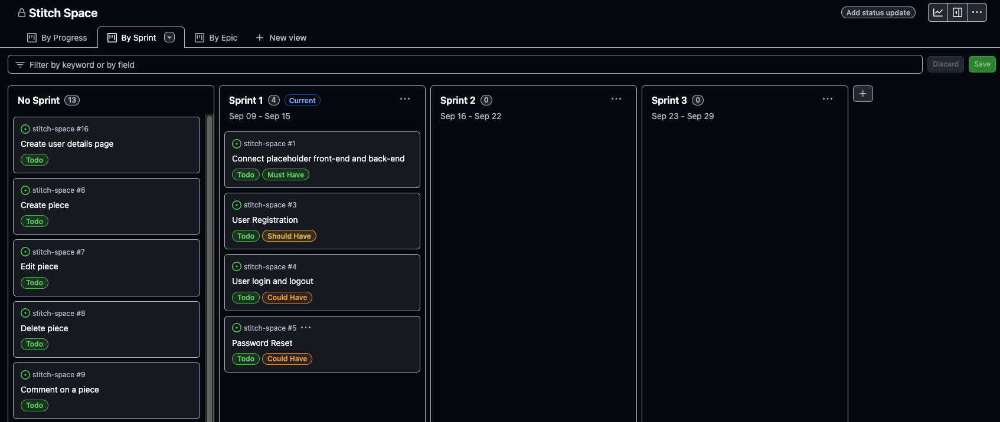

-   Sprint Planning: this involved taking the highest priority issues and assigning them to the first sprint. The highest priority story involves wiring up the front and back ends so may take up the whole sprint. This was the only one marked as must have. The next two were should haves and the final one a could have. This gave me a breakdown of 25% for must, 50% for should and 25% for could.
-   Sprint Retrospective:
    -   Achievements: Completing the thin slice and connecting the placeholder front-end and back-end.
    -   Progress: A stable, deployed base on which to develop the rest of the project.
    -   Challenges: There was less time than anticipated to work on my project and the thin slice proved more difficult to complete too. The Cross-Origin Resource Sharing (CORS) element needed specific configuration that took a while to figure out for example.
    -   Action Next Sprint: The goal for next sprint is to get the basic page structure created with dummy data, to provide a basis from which to develop the back-end further in future sprints.

### Sprint Two: 16/09 to 22/09


-   Sprint Planning: Creating the basic home page and the user details page are must haves this sprint, then the remaining stories from Epic 4: Browsing Pieces are distributed between should haves and could haves. The breakdown for this sprint is 40% must have, 40% should have and 20% could have.
-   Sprint Retrospective:
    -   Achievements: Completing such a large amount of work in one sprint.
    -   Progress: Created all of the front end pages and created all the models, views and endpoints for the API.
    -   Challenges: Switching between the front and back ends was difficult at times, as different languages and mindsets were required. Also, knowing how to break up the stories in this type of project. I cancelled a couple of existing user stories, and added 6 more to cover the creation and API integration of each model. I then worked on 6 stories at once, incrementally adding to each of them. This doesn't feel optimal.
    -   Action Next Sprint: The goal for the third sprint is to finish the whole project. I managed to set aside a lot of time for these two sprints to aim to finish by the end of September. This will involve integration of the front-end and the API, then the implementation of the final small pieces of functionality such as receiving notifications.

### Sprint Three: 23/09 to 29/09

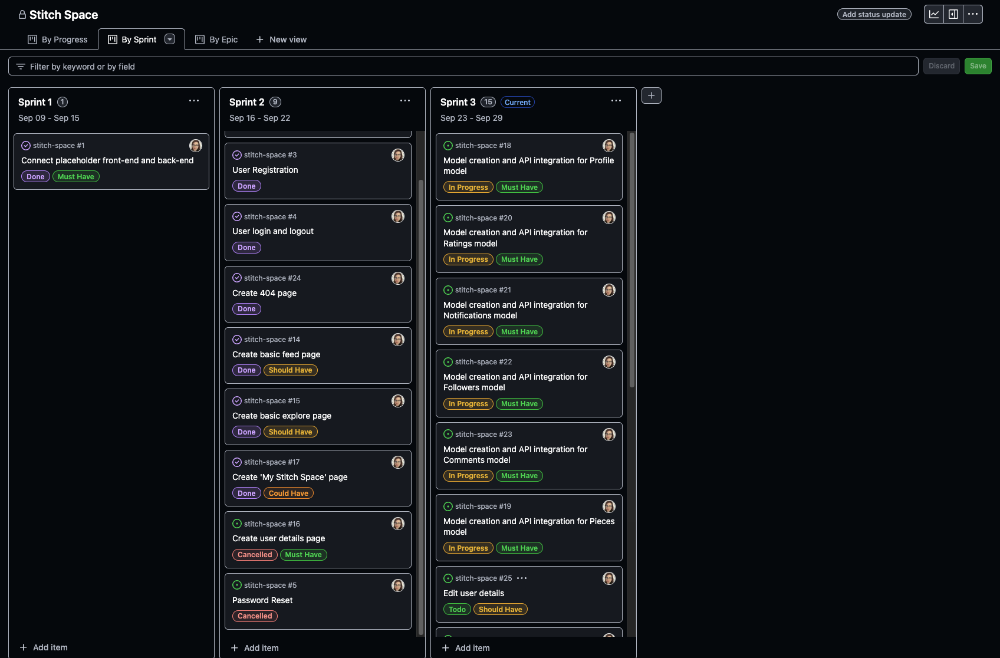

-   Sprint Planning: Completing the API integration is a must have this sprint, so all 6 of these stories have been marked as such. The remaining stories have been added to this sprint and marked as should haves, as I am aiming to finish this project this sprint. This gives me 40% must haves and 60% should haves.
-   Sprint Retrospective:
    -   Achievements: Completing all user stories.
    -   Progress: The bulk of the work was finished in this sprint, leaving just the final parts to polish off and some bugs to fix, followed by the write up in the READMEs for the front and back end repositories.
    -   Challenges: There was a steep learning curve here with the integration, so this took more time than anticipated.

### Wrapping Up: 30/09 to 02/10

These few days were dedicated to the final write up in this README as well as the README in the back end repository. This involved activities such as ensuring accuracy of information, details of testing and bugs and accessibility validation.

## 9. Future Development

-   Add Password Reset functionality for users that have forgotten their password or want to change it.
-   Provide functionality for directly uploading images to the site rather than using URLs of images hosted elsewhere
-   Add a user-level rating which averages the ratings on all their pieces and displays it in the Profile sidebar of the My Stitch Space page.
-   Expand to more obscure fibre arts.
-   Allow users to indicate where a piece belongs to more than one art type.
-   Allow users to be included on the same piece where they've collaborated.
-   Improve endpoints so that it is not possible to create nonsensical entries when hitting them directly, e.g. creating a notification for a user that tells them something relevant to a different user.

## 10. Credits

-   I built my flowcharts using [Mermaid](https://mermaid.js.org/syntax/flowchart.html) in my readme.
-   I visually represented my colour palette using [Adobe Colour](https://color.adobe.com/create/color-wheel).
-   I sourced my icons from [Font Awesome](https://fontawesome.com/).
-   I turned my icon from Font Awesome into a favicon with [Fonticon](https://gauger.io/fonticon/)
-   I generated all my different favicons with [Real Favicon Generator](https://realfavicongenerator.net/)
-   I used [ChatGPT](https://chatgpt.com) to explain error messages, advise on set up and research the best way to go about my implementation.
-   Reference for using Vite instead of Create React App: https://www.freecodecamp.org/news/how-to-create-a-react-app-in-2024/
-   This helped me figure out the mistake I made in the Vite setup where I put `express` in the wrong dependencies section: [Heroku troubleshooting docs](https://devcenter.heroku.com/articles/troubleshooting-node-deploys)
-   The image on the 404 page is by [Noor Sethi on Unsplash](https://unsplash.com/@noorsethi?utm_content=creditCopyText&utm_medium=referral&utm_source=unsplash)
-   I used images from [Lorem Picsum](https://picsum.photos/) during development to give me plenty of data to work with, and for the example pieces in the system that are not the Featured Artist pieces on the Home Page carousel.
-   I used [Masonic](https://github.com/jaredLunde/masonic) library to handle tiling of pieces in places such as the Feed and Explore pages.

-   The images on the Featured Artists carousel on the home page have been sourced from [Unsplash](https://unsplash.com/):
    -   Photo titled 'Pandemic Times' is by [Swati H. Das](https://unsplash.com/photos/pink-blue-and-yellow-wooden-musical-instrument-mHkeT419LGM)
    -   Photo titled 'Dark Florals' is by [Ksenia Yakovleva](https://unsplash.com/photos/a-close-up-of-a-embroidery-on-a-black-cloth-with-a-pair-of-scissors-GkwoMPCmwDs)
    -   Photo titled 'Renaissance Woman' is by [Olga Kalinina](https://unsplash.com/photos/a-close-up-of-a-embroidery-on-a-table-k2jyiW9z9yc)

I also used the documentation of all the elements included in this project:

-   [Vite](https://vitejs.dev/guide/)
-   [Vitest](https://vitest.dev/)
-   [React](https://react.dev/reference/react)
-   [React-Bootstrap](https://react-bootstrap.netlify.app/docs/getting-started/introduction)

Thank you to fellow Code Institute student Dennis Schenkel who told me about Vite as an option instead of the deprecated 'Create React App'.

**General Credit**
As ever, I want to thank the open source community for the great resources that teach me so much and also remind me of what I learnt in my Code Institute lessons. I also referenced the learning materials and 'Moments' walkthrough projects throughout development to inform my coding decisions.

I believe I have credited where I used specific items in the previous section but this is a general credit to the reference resources I looked through to teach me new elements as well as reminding me how things I'd already come across worked as I went along.

Every effort has been made to credit everything used, but if I find anything else specific later on that needs crediting, that I missed, I will be sure to add it.
